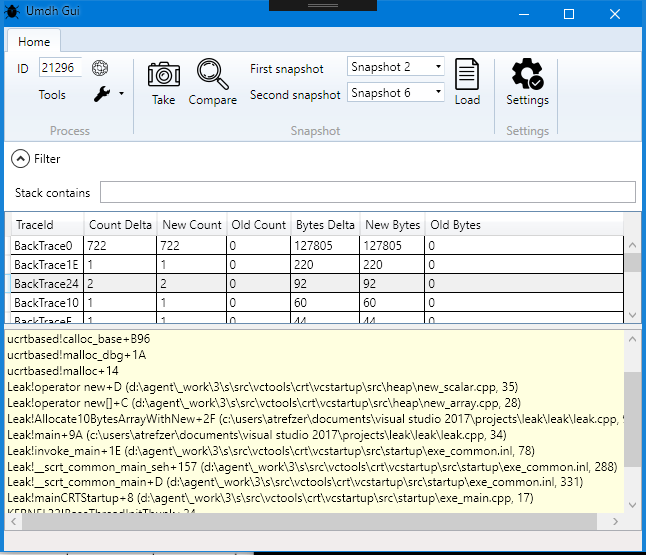
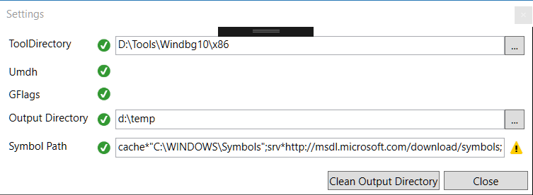

# UmdhGui
Graphical user interface for the UMDH tool

UMDH is a command line utility that comes with WinDbg. It is used to find memory leaks in native applications.
UmdhGui is a graphical user interface for this utility.

## Instructions

As a prerequisite you need to have the latest WinDbg from the Windows SDK installed.

Compile and run the application

Then click the settings button to choose the directory where the WinDbg.exe is located. 
Also choose a directory where UmdhGui shall write its output files.

Note: To debug a 64 bit application you have to choose the 64 bit directory of the windows debugger.

Close the settings dialog and select the process to analyze in the main window
Click “Take snapshot” to collect the allocation stack traces.

If you did not enable collecting stack trace allocations via gflags -i Leak.exe +ust yet UMDH does this now for you.
UmdhGui writes the snapshots as files to the chosen output directory.

Now waste memory and take a second snapshot.

If you have collected at least two snapshots, you can show the differences between the two by clicking the “Compare” button.

The stack traces and their details (delta count and bytes) are displayed.

## Resources

Icons:

<ul>
  
 <li>

Icons made by <a href="https://www.freepik.com/" title="Freepik">Freepik</a> from <a href="https://www.flaticon.com/" 			    title="Flaticon">www.flaticon.com</a> is licensed by <a href="http://creativecommons.org/licenses/by/3.0/" 			    title="Creative Commons BY 3.0" target="_blank">CC 3.0 BY</a>

</li>
<li>

Icons made by <a href="https://www.flaticon.com/authors/pixel-perfect" title="Pixel perfect">Pixel perfect</a> from <a href="https://www.flaticon.com/" 			    title="Flaticon">www.flaticon.com</a> is licensed by <a href="http://creativecommons.org/licenses/by/3.0/" 			    title="Creative Commons BY 3.0" target="_blank">CC 3.0 BY</a>

  </li>

</ul>
