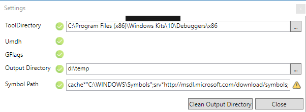

# UmdhGui
Graphical user interface for the UMDH tool

UMDH is a command line utility that comes with WinDbg to find memory leaks in native applications.
UmdhGui is a graphical user interface for this command line utility.

## Instructions

As a prerequisite you need to have the latest WinDebug from the Windows SDK installed (not from the AppStore)

1) Compile and run the application:

2) Enter settings:
   - Click the settings button to choose the directory where the WinDbg.exe is located.  
  **Note**: To debug a 64 bit application you have to choose the 64 bit directory of WinDbg.exe
  
   - Choose a directory where UmdhGui shall write its output files.

3) Close the settings dialog and select the process to analyze in the main window
4) Click “Take snapshot” to collect the allocation stack traces
5) Leak some memory and take a second snapshot.
6) Click “Compare” to visualize the differences between two snapshots.

## Info
UmdhGui writes the snapshots as files to the chosen output directory (see step 2).  
If collecting stack trace allocations is not permanently enabled via “gflags -i Leak.exe +ust” UMDH will temporarily enable it.
## Resources

Icons:

<ul>
  
 <li>

Icons made by <a href="https://www.freepik.com/" title="Freepik">Freepik</a> from <a href="https://www.flaticon.com/" 			    title="Flaticon">www.flaticon.com</a> is licensed by <a href="http://creativecommons.org/licenses/by/3.0/" 			    title="Creative Commons BY 3.0" target="_blank">CC 3.0 BY</a>

</li>
<li>

Icons made by <a href="https://www.flaticon.com/authors/pixel-perfect" title="Pixel perfect">Pixel perfect</a> from <a href="https://www.flaticon.com/" 			    title="Flaticon">www.flaticon.com</a> is licensed by <a href="http://creativecommons.org/licenses/by/3.0/" 			    title="Creative Commons BY 3.0" target="_blank">CC 3.0 BY</a>

  </li>

</ul>
